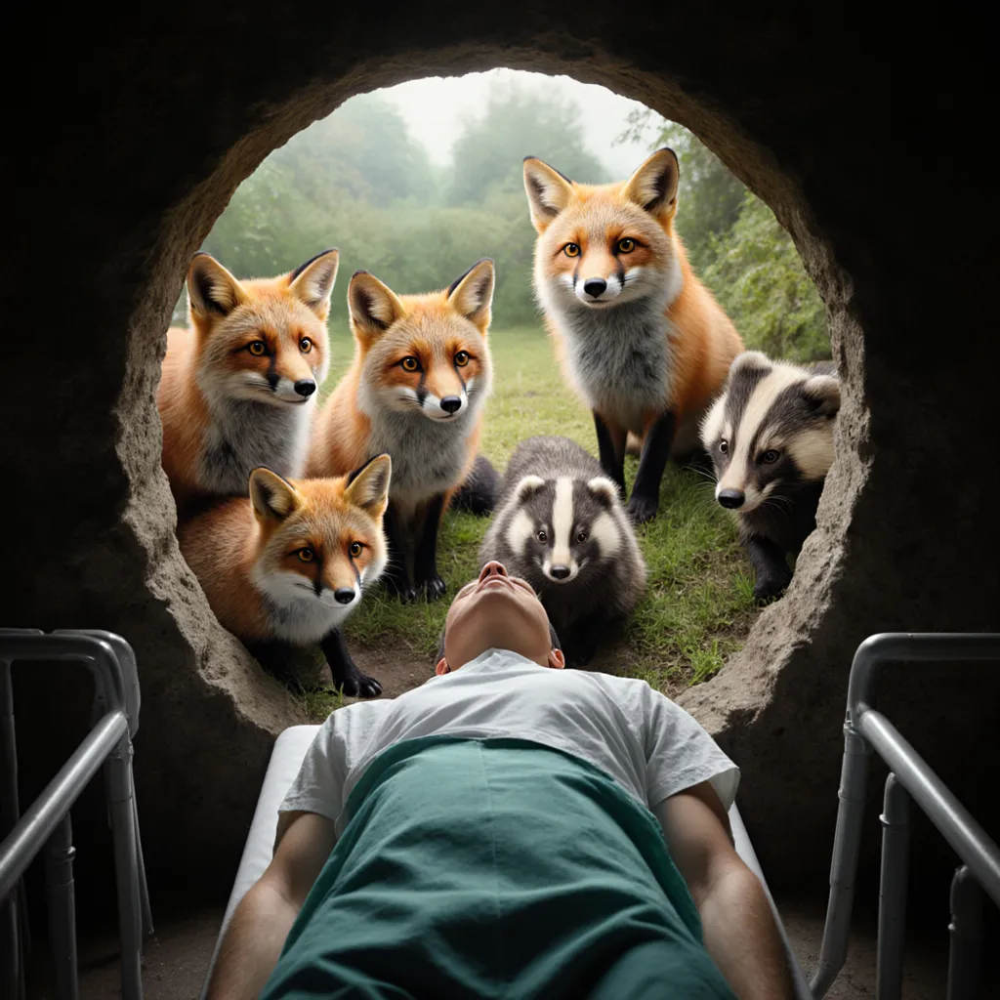
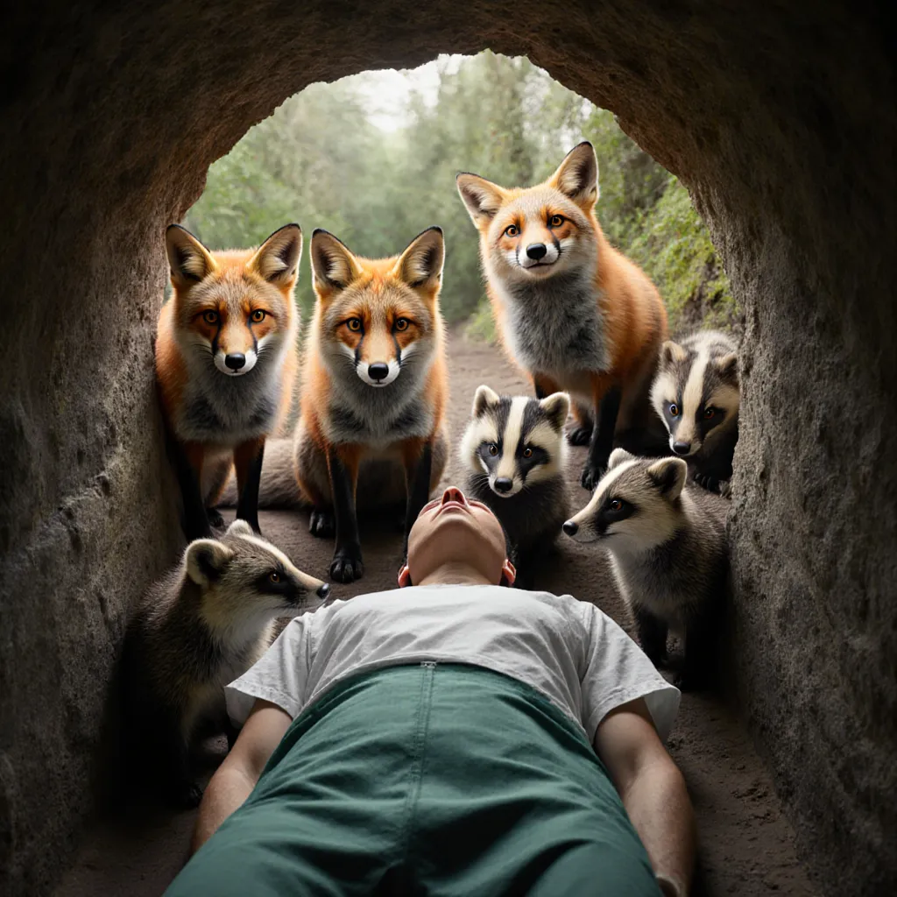

# director-diffusion

  
   
  <a href="https://nano-diffusion--flux-lora-gradio-gradio-app.modal.run/" target="_blank">
    <b>Try the Director-Diffusion Gradio App &rarr;</b>
  </a>

Director-Diffusion is an open-source package to train Low Rank Adaptation Matrices of the Flux1.Krea-dev model to fit the style of famous directors. The directors chosen here are Christopher Nolan, Martin Scorsese, Wes Anderson, Denis Villeneuve, and David Fincher, but the code is broadly applicable. They are so chosen for their unique styles and my personal affinity for their work.

Each LoRA each took ~11 H200 hours to train, and is optimized in a number of ways, including but not limited to: VAE caching, image interpolation, optimized attention via xformers, torch.compile(), Cosine LR annealing. Captioning took around 45 H200 minutes (done in parallel). Models and model cards are given below:

-  Nolan: 
-  Villeneuve: 
-  Anderson: 
-  Fincher: 
-  Scorsese: 

## Results

The following comparisons showcase the dramatic difference between the base Flux-Krea model and each director-specific LoRA. Each pair uses the same prompt to highlight the unique stylistic transformations.

### Christopher Nolan
*Prompt: "Two spy agents running up a stairwell, tense"*

| Base Model | Nolan LoRA |
|------------|------------|
|  |  |

### Denis Villeneuve
*Prompt: "A vast desert landscape with mysterious structures"*

| Base Model | Villeneuve LoRA |
|------------|-----------------|
|  |  |

### Wes Anderson
*Prompt: "A group of foxes and badgers in an underground tunnel looking down at a patient, in Wes Anderson's style"*

| Base Model | Anderson LoRA |
|------------|---------------|
|  |  |

### David Fincher
*Prompt: "Urban decay around detectives walking"*

| Base Model | Fincher LoRA |
|------------|--------------|
|  |  |

### Martin Scorsese
*Prompt: "A gritty street scene with dynamic camera angles"*

| Base Model | Scorsese LoRA |
|------------|---------------|
|  |  |

## Roadmap

- [x] Image Collection and Data Verification
- [x] Caption data and verify performance of script
- [x] Train LoRAs on single director
- [x] Train Multi Director LoRA
- [x] Serve model off Gradio App
- [x] Complete evaluation using metrics
- [ ] Surface metrics from blind voting
- [ ] Create LCM distillation of each LoRA

## Getting Started

To run the code, sync the uv environment (`uv sync`) and run the following commands:

- captioning: `uv run modal run -m src.caption`. You can then upload the images to remote modal storage using `modal volume`.
- train: `uv run modal run -m src.train`. You will likely need to add the `detach` flag as well to ensure that the train run does not get limited by session length.
- serve: `uv run modal serve -m src.serve` (for local dev).
- deploy: `uv run modal deploy -m src.serve`

## Uses

- Flux 1 - Krea dev (black-forest-labs/FLUX.1-Krea-dev) as the base model for training (chosen over Flux1.dev for its realism, I like this [article](https://www.dbreunig.com/2025/08/04/the-rise-of-opinionated-models.html) for further reading)
- uv for package management
- ruff for code quality
- ty for type checking
- modal for infrastructure
- shotdeck (https://shotdeck.com/welcome/home) for training stills and data (chosen over ffmpeg due to higher fidelity and wider variety of shots)
- Qwen 2.5VL - 3B for image captioning (chosen over BLIP-2 and others for prompt faithfulness and ability to perceive style)

## Dataset

Images were collected from shotdeck.com. Director counts for each image are listed below:

- Anderson: 201 images
- Fincher: 214 images
- Nolan: 232 images
- Scorsese: 215 images
- Villeneuve: 197 images

## Evaluation Results

- **CLIP Similarity:** −0.3% average change
  _Top performer: Villeneuve_

- **Aesthetic Score:** +4.2% average improvement
  _Top performer: Fincher_

- **Style Score:** +0.7% average improvement
  _Top performer: Villeneuve_

## Questions?
If you see an error or bug, please open an issue on GitHub, or better yet, open a pull request! I welcome contributions. For feedback / ideas please email me at me@karansampath.com.

## Acknowledgments
I'd like to thank Alec Powell and the team at Modal for their support of this work through GPU credits. Also, thank you to the team at Astral for their great open-source work!

## Further Reading

- https://www.krea.ai/blog/flux-krea-open-source-release
- https://modal.com/blog/flux-3x-faster
- https://modal.com/docs/examples/diffusers_lora_finetune
- https://arxiv.org/pdf/2210.03142
- https://arxiv.org/abs/2407.15811
- https://arxiv.org/abs/2006.11239
- https://arxiv.org/abs/2010.02502
- https://arxiv.org/abs/2207.12598
